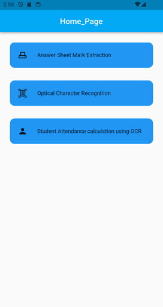
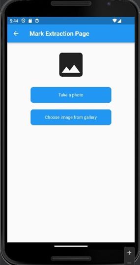
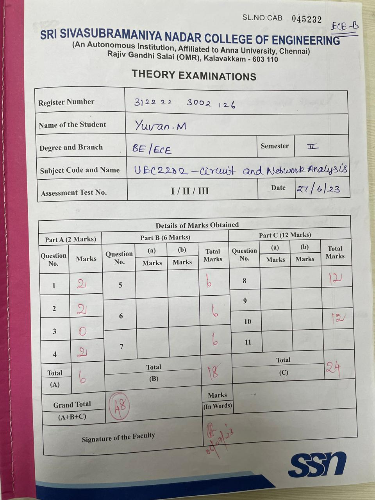
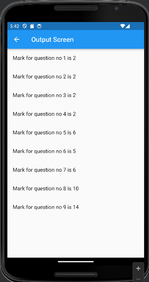
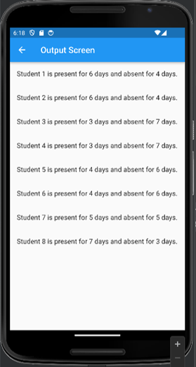

# Zenith Hackathon 2024 (Team: HunterTech)

## Attendance and Test Marks Recognition

A flutter app that can recognize specific tabular data like attendance records and answer sheet marks from an image and process them to be stored as digital data

## How it works

This app is a simple frontend that allows an user to pick from the following actions:
- Answer Sheet Mark extraction
- Optical Character Recognition
- Attendance calculation

</img>

Then the user can provide an input image either from their gallery or take a photograph

</img>

The application then makes a **POST request** to the backend which takes the image, pre-processes it, and feeds it into our machine learning model.
Answer Sheet Mark Recognition and Attendance calculation are performed via a backend that uses a custom model created by us; Optical Character Recognition is performed using google's off-the-shelf model.

Example Inputs to the Marksheet evaluation and Attendance calculation:

</img>
</img>

Outputs for the above:

</img>
</img>

Go to the [backend directory](backend/) to learn more about the ML model's implementation
