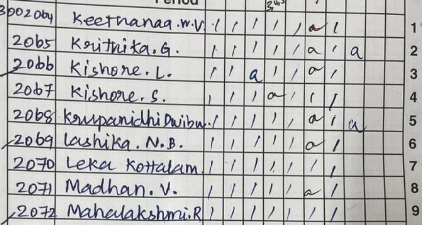

# Attendance and Test Marks Digitizer App

A flutter app that can recognize specific tabular data like attendance records and answer sheet marks from an image and process them accordingly

## How it works

This app is a simple frontend that allows an user to pick from the following actions:
- Answer Sheet Mark extraction
- Optical Character Recognition
- Attendance calculation

Then the user can provide an input image either from their gallery or take a photograph

The application then makes a POST request to the backend which takes the image, pre-processes it, and feeds it into our machine learning model.
Answer Sheet Mark Recognition and Attendance calculation are performed via a backend that uses a custom model created by us; Optical Character Recognition is performed using google's off-the-shelf model.

Example Inputs to the Marksheet evaluation and Attendance calculation:

Outputs for the above:

Learn more about how the backend ML model works from [its github repo](https://github.com/Pranavcm-07/ocr-ml-model)
